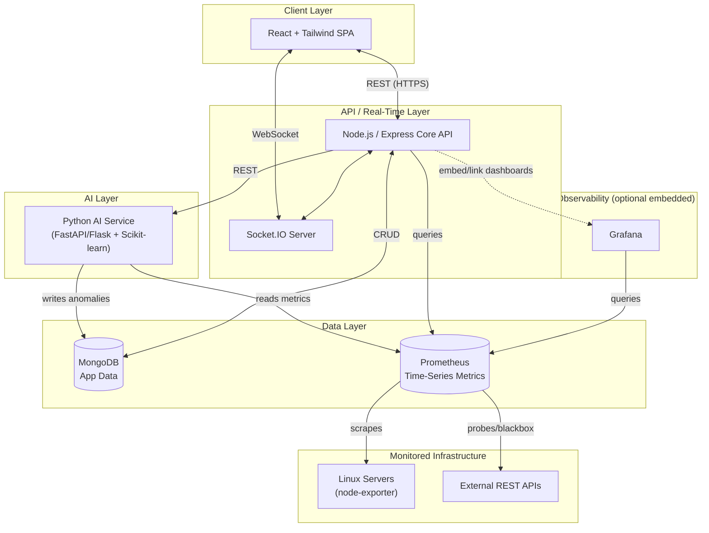
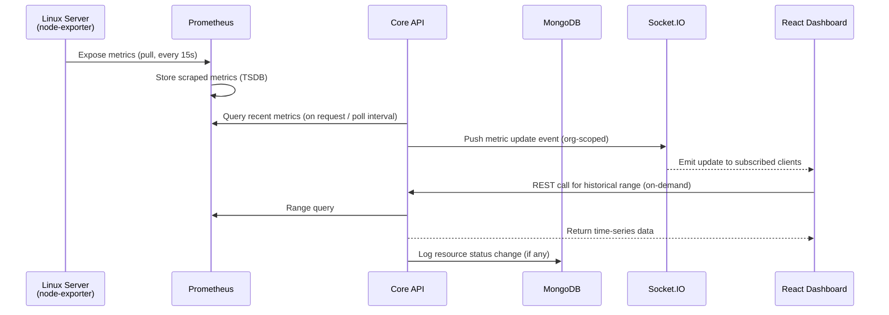
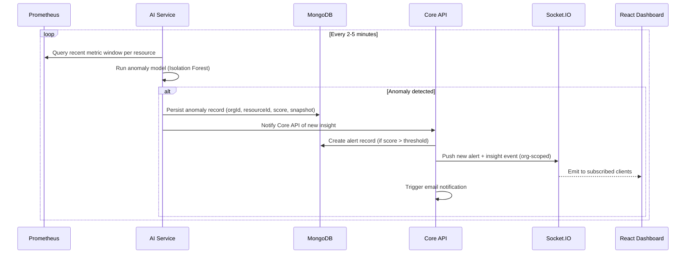
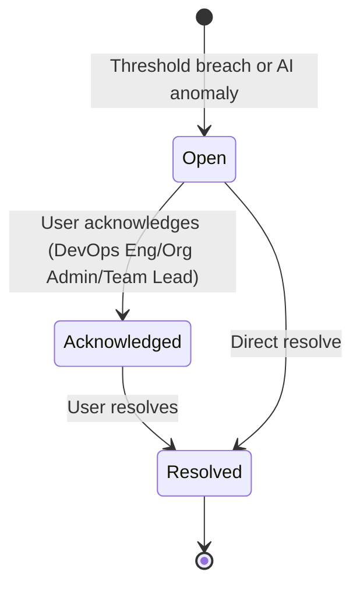
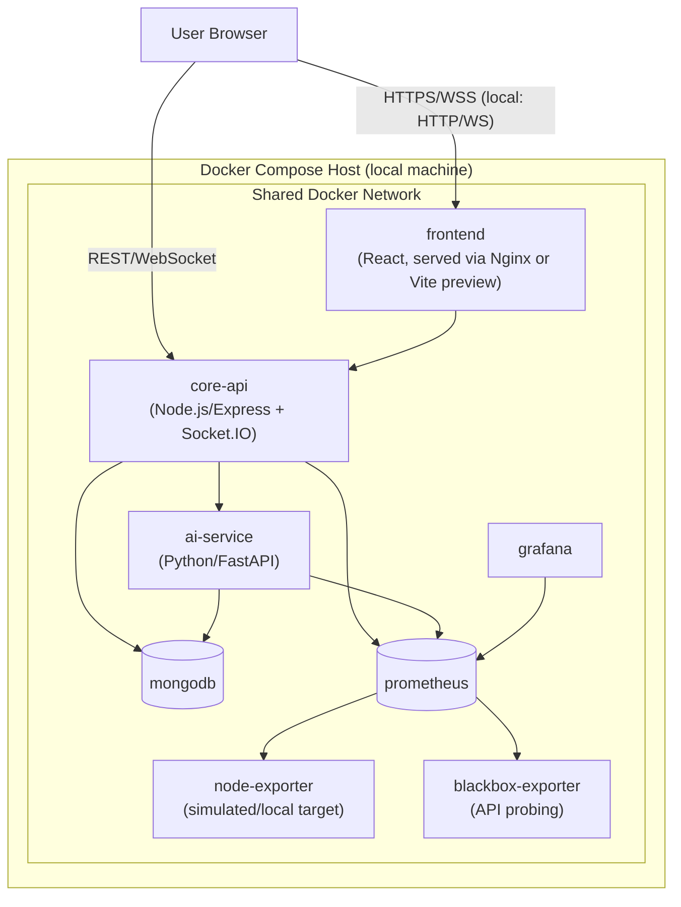

# System Architecture Document
## AI-Powered DevOps Monitoring Platform — MVP

**Document Version:** 1.0
**Status:** MVP Baseline
**Related Documents:** 01-vision-and-scope.md, 02-srs-mvp.md, 03-user-roles-permission-matrix.md

---

## 1. Purpose

This document defines the technical architecture of the MVP: service boundaries, how components communicate, how data flows from monitored infrastructure to the dashboard, and how the platform is deployed locally. It is the implementation blueprint that the SRS's functional requirements and the permission matrix's enforcement rules get built against.

---

## 2. Architectural Style

The platform uses a **modular service-oriented architecture**, not a monolith and not a full microservices mesh — a deliberate middle ground appropriate for a solo-developer portfolio project that still needs to demonstrate service separation, independent scalability, and clean boundaries.

Four independently deployable units:

1. **Frontend** — React SPA
2. **Core API** — Node.js/Express (auth, orgs, resources, alerts, reporting)
3. **AI Service** — Python (anomaly detection, model scoring)
4. **Metrics Infrastructure** — Prometheus + exporters + Grafana (optional embedded views)

Backed by MongoDB (application data) and Prometheus's own TSDB (metrics data) — a deliberate **polyglot persistence** split: operational/relational-ish data in MongoDB, time-series metrics in Prometheus, rather than forcing both into one store.

---

## 3. High-Level Architecture

**Key architectural decisions reflected above:**

- The React SPA never talks to MongoDB, Prometheus, or the AI service directly — the **Core API is the single entry point**, enforcing auth, RBAC, and `orgId` scoping before any data reaches the client.
- The **AI Service is decoupled** from the Core API — it reads metrics from Prometheus and writes results to MongoDB independently, communicating with the Core API only via a REST contract (e.g., "trigger scoring," "get latest insights"). This lets it be scaled, redeployed, or even reimplemented without touching the Node.js codebase.
- **Grafana is optional/supplementary** in MVP — it demonstrates ecosystem familiarity but is not on the critical path for any functional requirement; the product's own dashboard (React) is the primary UX.

---

## 4. Component Responsibilities

### 4.1 React Frontend (Client Layer)
- Renders dashboards, forms, alert views, AI insights, reports
- Holds JWT access token in memory (not localStorage, to reduce XSS exposure) and uses refresh flow via httpOnly cookie or secure storage per Security Design Doc
- Subscribes to Socket.IO for near-real-time metric/alert updates, scoped to the authenticated org
- Enforces role-based UI gating as a UX convenience (mirrors the Permission Matrix); never the actual security boundary

### 4.2 Core API (Node.js / Express)
Responsibilities, mapped to SRS sections:
- **Auth module** (FR-1.x): registration, login, JWT issuance/refresh, bcrypt hashing
- **Org & User module** (FR-1.x): org CRUD, user invitation, role assignment
- **Resource module** (FR-2.x, FR-3.x): register/manage Linux servers and API monitors; writes resource metadata to MongoDB; configures Prometheus scrape/probe targets
- **Alert module** (FR-6.x): alert rule evaluation (threshold-based), alert lifecycle (ack/resolve), triggers email + in-app notification dispatch
- **Reporting module** (FR-7.x): builds CSV exports from MongoDB + Prometheus query results
- **RBAC middleware**: resolves `(userId, orgId, role)` from JWT on every request; enforces the Permission Matrix before handlers execute
- **Socket.IO gateway**: pushes metric updates, new alerts, and new AI insights to connected clients, scoped by org room (e.g., clients join a `org:{orgId}` room on connect)

### 4.3 AI Service (Python)
- **Metric ingestion**: periodically queries Prometheus (via its HTTP query API) for recent metric windows per monitored resource
- **Anomaly scoring**: runs an unsupervised model (Isolation Forest, via Scikit-learn) per resource/metric window on a batch interval (e.g., every 2–5 minutes, per FR-4.1)
- **Insight persistence**: writes detected anomalies (resource ref, timestamp, metric snapshot, anomaly score) to MongoDB
- **Insight API**: exposes a small internal REST API the Core API calls to trigger on-demand scoring or fetch latest insights
- Runs as an independent process/container so its scoring cadence, dependencies (Pandas/NumPy/Scikit-learn), and scaling are decoupled from the Node.js API

### 4.4 MongoDB (Application Data Store)
- Stores: organizations, users, roles, monitored resource metadata, alert records, anomaly records, notification preferences, report export metadata
- Every collection includes an `orgId` field; every query path is scoped by it (see Data Model doc for schema detail)
- Does **not** store raw high-frequency time-series metrics — that's Prometheus's job

### 4.5 Prometheus (Metrics Store & Collector)
- Scrapes `node-exporter` running on each registered Linux server for CPU/memory/disk/network metrics (FR-2.2)
- Uses the **Blackbox Exporter** (or equivalent probe mechanism) to perform REST API uptime/latency checks against registered endpoints (FR-3.2)
- Serves as the queryable time-series source for both the Core API (for dashboard graphs/reports) and the AI Service (for anomaly scoring input)
- Target configuration (which servers/APIs to scrape) is driven by the Core API writing to Prometheus's file-based service discovery, keeping "what to monitor" as an application-level decision, not a manually-edited Prometheus config

### 4.6 Grafana (Supplementary Visualization)
- Optional pre-built dashboards over the same Prometheus data source, primarily to demonstrate familiarity with the standard Prometheus/Grafana ecosystem
- Not required for any MVP functional requirement to be satisfied — the product's own React dashboard is authoritative for user-facing monitoring

### 4.7 Socket.IO (Real-Time Channel)
- Runs alongside the Core API (same Node.js process for MVP simplicity; can be extracted to a dedicated service in Phase 2 if scaling requires it)
- Delivers: live metric ticks, new alert events, new AI insight events
- Enforces the same `orgId` scoping as REST — clients only join rooms for their own organization, validated server-side at connection time using the JWT, not a client-supplied org ID

---

## 5. Data Flow

### 5.1 Metrics Collection & Display Flow

### 5.2 AI Anomaly Detection Flow

### 5.3 Alert Lifecycle Flow

---

## 6. Deployment Architecture (MVP — Local via Docker Compose)

Per the Vision & Scope decision, MVP runs locally via Docker Compose. Kubernetes manifests are produced as a documented deployment artifact (Phase 2+) but are not the primary demo runtime.

**Container list (docker-compose services):**

| Service | Image Base | Exposed Port (local) | Notes |
|---|---|---|---|
| `frontend` | node:alpine (build) → nginx:alpine (serve) | 3000 | Serves compiled React build |
| `core-api` | node:lts-alpine | 5000 | Express + Socket.IO |
| `ai-service` | python:slim | 8000 | FastAPI + Scikit-learn/Pandas/NumPy |
| `mongodb` | mongo:latest | 27017 | Single instance, volume-backed |
| `prometheus` | prom/prometheus | 9090 | Config includes core-api-managed service discovery file |
| `node-exporter` | prom/node-exporter | 9100 | Represents a monitored Linux host (can be run on additional demo VMs too) |
| `blackbox-exporter` | prom/blackbox-exporter | 9115 | Probes registered REST APIs |
| `grafana` | grafana/grafana | 3001 | Pre-provisioned Prometheus data source |

All services communicate over a shared Docker bridge network by service name (e.g., `core-api` reaches Mongo at `mongodb:27017`), avoiding hardcoded IPs — the same pattern that translates directly into Kubernetes Service DNS names when Phase 2 introduces the K8s deployment.

---

## 7. Technology Stack Summary

| Layer | Technology | Role |
|---|---|---|
| Frontend | React.js + Tailwind CSS | SPA, dashboards, forms |
| Real-time | Socket.IO | Push updates to dashboard |
| Backend API | Node.js + Express.js | Auth, business logic, RBAC, orchestration |
| AI Service | Python + Scikit-learn, Pandas, NumPy | Anomaly detection scoring |
| App Database | MongoDB | Orgs, users, resources, alerts, anomalies |
| Metrics Database | Prometheus | Time-series infrastructure/API metrics |
| Metrics Collection | node-exporter, blackbox-exporter | Server and API metric/probe collection |
| Visualization (supplementary) | Grafana | Ecosystem-standard dashboards |
| Containerization | Docker / Docker Compose | Local packaging & orchestration (MVP) |
| Future Deployment | Kubernetes | Phase 2+ production-style deployment artifact |

---

## 8. Cross-Cutting Concerns

### 8.1 Multi-Tenancy Enforcement Point
All `orgId` scoping is enforced in the **Core API's middleware layer**, not in the database layer and not in the frontend. This is the single chokepoint referenced in the Permission Matrix (§5, Enforcement Notes) and detailed further in the Security Design Document.

### 8.2 Service Communication Security (MVP)
- Frontend ↔ Core API: HTTPS in a real deployment; HTTP acceptable for local Docker Compose demo, documented as a known simplification
- Core API ↔ AI Service: internal REST, not exposed outside the Docker network
- Core API ↔ Prometheus: internal REST, not exposed outside the Docker network
- Only `frontend` and `core-api` ports are intended to be reachable from outside the Docker network in a real deployment; other services are internal-only (reflected in Kubernetes NetworkPolicy design in Phase 2)

### 8.3 Failure Isolation
- AI Service outage: Core API and dashboard continue operating on raw metrics/alerts; anomaly detection simply pauses (graceful degradation, not a hard dependency)
- Prometheus outage: Core API serves last-known resource status from MongoDB cache/state, flags data as stale in the UI rather than crashing
- MongoDB outage: Core API returns clear error state; Socket.IO layer stays up for connection but cannot serve fresh queries

---

## 9. Explicit Architectural Deferrals (Phase 2+)

| Concern | MVP Approach | Phase 2+ Plan |
|---|---|---|
| Container/K8s monitoring | Not included | cAdvisor + kube-state-metrics added as new Prometheus targets; no core architecture change needed |
| Log management | Not included | ELK stack introduced as a parallel pipeline (Filebeat/Logstash → Elasticsearch), separate from the metrics path |
| AI Service scaling | Single instance | Horizontal scaling behind a queue (e.g., simple job queue) if scoring volume grows |
| Deployment target | Docker Compose, local | Kubernetes manifests/Helm chart, same service boundaries, adds Ingress + NetworkPolicy + HPA |
| Socket.IO scaling | Single Node.js process | Redis adapter for Socket.IO if multiple API instances are introduced |

---

## 10. Traceability to SRS

| SRS Section | Architecture Component(s) |
|---|---|
| FR-1.x (Auth & Org) | Core API — Auth module, MongoDB |
| FR-2.x (Linux servers) | node-exporter, Prometheus, Core API — Resource module |
| FR-3.x (REST APIs) | blackbox-exporter, Prometheus, Core API — Resource module |
| FR-4.x (AI anomaly detection) | AI Service, Prometheus, MongoDB |
| FR-5.x (Dashboards) | React Frontend, Socket.IO, Core API |
| FR-6.x (Alerts) | Core API — Alert module, Socket.IO, email dispatch |
| FR-7.x (Reporting) | Core API — Reporting module, MongoDB, Prometheus |
| NFR-2 (Multi-tenancy) | Core API middleware (§8.1) |
| NFR-3 (Performance) | Socket.IO push model (§5.1) |
