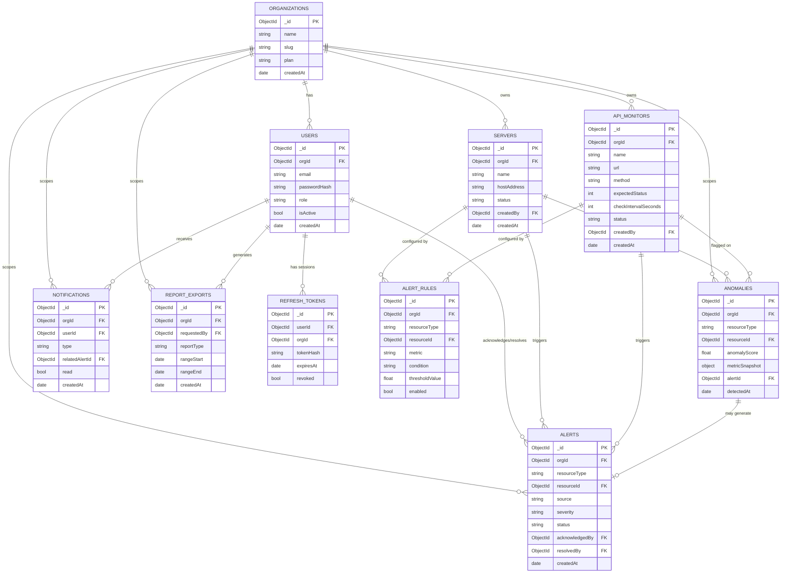

# MongoDB Data Model & Entity-Relationship Diagram
## AI-Powered DevOps Monitoring Platform — MVP

**Document Version:** 1.0
**Status:** MVP Baseline
**Related Documents:** 02-srs-mvp.md, 03-user-roles-permission-matrix.md, 04-system-architecture.md

---

## 1. Purpose

This document defines every MongoDB collection used by the Core API in the MVP, their fields, relationships, indexes, and validation rules. It also defines precisely how the `orgId` field enforces multi-tenant data isolation — the concrete implementation of NFR-2 and Permission Matrix §5.

**Reminder from the Architecture Document (§4.4):** MongoDB stores application/operational data only. Raw time-series metrics live in Prometheus, not MongoDB.

---

## 2. Collection Overview

| Collection | Purpose |
|---|---|
| `organizations` | Tenant records — the root of the multi-tenancy boundary |
| `users` | User accounts, roles, credentials (hashed), org membership |
| `refreshTokens` | Active/revocable refresh tokens per user session |
| `servers` | Registered Linux server resources |
| `apiMonitors` | Registered REST API resources |
| `alertRules` | Threshold configuration per resource |
| `alerts` | Alert instances (threshold or AI-triggered) |
| `anomalies` | AI-detected anomaly records |
| `notifications` | In-app notification records per user |
| `reportExports` | Metadata log of generated CSV exports |

Every collection except `organizations` itself contains an `orgId` field. This is the single rule that makes multi-tenancy enforceable — detailed in §6.

---

## 3. Entity-Relationship Diagram



---

## 4. Collection Schemas

### 4.1 `organizations`

```json
{
  "_id": "ObjectId",
  "name": "string, required",
  "slug": "string, required, unique",
  "plan": "string, enum ['free','pro','enterprise'], default 'free'",
  "isActive": "bool, default true",
  "notificationDefaults": {
    "alertEmailRecipients": ["string (email)"]
  },
  "createdAt": "date",
  "updatedAt": "date"
}
```

**Indexes:**
- `{ slug: 1 }` — unique
- `{ isActive: 1 }`

**Notes:** This is the tenancy root. No `orgId` field on this collection itself — `_id` **is** the `orgId` referenced everywhere else.

---

### 4.2 `users`

```json
{
  "_id": "ObjectId",
  "orgId": "ObjectId, required, ref: organizations",
  "email": "string, required, unique per org",
  "passwordHash": "string, required",
  "role": "string, enum ['super_admin','org_admin','devops_engineer','team_lead','viewer'], required",
  "isActive": "bool, default true",
  "notificationPreferences": {
    "emailEnabled": "bool, default true",
    "inAppEnabled": "bool, default true"
  },
  "createdAt": "date",
  "updatedAt": "date"
}
```

**Indexes:**
- `{ orgId: 1, email: 1 }` — unique compound (email unique **within** an org, not globally — two orgs may each have an `admin@company.com` if they're different companies with the same convention... though in practice email will usually be globally unique too; the compound index is the tenancy-correct constraint)
- `{ orgId: 1, role: 1 }` — for role-based queries within an org

**Special case:** `super_admin` users have `orgId: null` — they are platform-level, not org-scoped. This is enforced explicitly in application logic (§6.4) since it's the one intentional exception to "every non-org document has an orgId."

---

### 4.3 `refreshTokens`

```json
{
  "_id": "ObjectId",
  "userId": "ObjectId, required, ref: users",
  "orgId": "ObjectId, required (nullable for super_admin), ref: organizations",
  "tokenHash": "string, required",
  "issuedAt": "date",
  "expiresAt": "date, required",
  "revoked": "bool, default false",
  "userAgent": "string, optional"
}
```

**Indexes:**
- `{ tokenHash: 1 }` — unique
- `{ userId: 1, revoked: 1 }`
- `{ expiresAt: 1 }` — TTL index, auto-expire documents after `expiresAt` (MongoDB TTL index)

**Notes:** Only the hash of the refresh token is stored, never the raw token (mirrors bcrypt-hashed passwords — defense in depth per Security Design Doc).

---

### 4.4 `servers`

```json
{
  "_id": "ObjectId",
  "orgId": "ObjectId, required, ref: organizations",
  "name": "string, required",
  "hostAddress": "string, required",
  "exporterPort": "int, default 9100",
  "status": "string, enum ['healthy','degraded','down','unknown'], default 'unknown'",
  "labels": ["string"],
  "createdBy": "ObjectId, ref: users",
  "createdAt": "date",
  "updatedAt": "date"
}
```

**Indexes:**
- `{ orgId: 1 }`
- `{ orgId: 1, status: 1 }`
- `{ orgId: 1, hostAddress: 1 }` — unique compound (no duplicate host registered twice within same org)

---

### 4.5 `apiMonitors`

```json
{
  "_id": "ObjectId",
  "orgId": "ObjectId, required, ref: organizations",
  "name": "string, required",
  "url": "string, required",
  "method": "string, enum ['GET','POST','HEAD'], default 'GET'",
  "expectedStatus": "int, default 200",
  "checkIntervalSeconds": "int, default 60, min 15",
  "status": "string, enum ['up','down','unknown'], default 'unknown'",
  "createdBy": "ObjectId, ref: users",
  "createdAt": "date",
  "updatedAt": "date"
}
```

**Indexes:**
- `{ orgId: 1 }`
- `{ orgId: 1, status: 1 }`
- `{ orgId: 1, url: 1 }` — unique compound

---

### 4.6 `alertRules`

```json
{
  "_id": "ObjectId",
  "orgId": "ObjectId, required, ref: organizations",
  "resourceType": "string, enum ['server','apiMonitor'], required",
  "resourceId": "ObjectId, required (ref: servers or apiMonitors depending on resourceType)",
  "metric": "string, required (e.g. 'cpu_utilization', 'memory_utilization', 'response_time_ms', 'error_rate')",
  "condition": "string, enum ['gt','gte','lt','lte'], required",
  "thresholdValue": "float, required",
  "enabled": "bool, default true",
  "createdAt": "date",
  "updatedAt": "date"
}
```

**Indexes:**
- `{ orgId: 1, resourceType: 1, resourceId: 1 }`
- `{ orgId: 1, enabled: 1 }`

---

### 4.7 `alerts`

```json
{
  "_id": "ObjectId",
  "orgId": "ObjectId, required, ref: organizations",
  "resourceType": "string, enum ['server','apiMonitor'], required",
  "resourceId": "ObjectId, required",
  "source": "string, enum ['threshold','anomaly'], required",
  "triggeringRuleId": "ObjectId, ref: alertRules, optional (null if source='anomaly')",
  "triggeringAnomalyId": "ObjectId, ref: anomalies, optional (null if source='threshold')",
  "severity": "string, enum ['low','medium','high','critical'], required",
  "status": "string, enum ['open','acknowledged','resolved'], default 'open'",
  "message": "string, required",
  "acknowledgedBy": "ObjectId, ref: users, optional",
  "acknowledgedAt": "date, optional",
  "resolvedBy": "ObjectId, ref: users, optional",
  "resolvedAt": "date, optional",
  "createdAt": "date"
}
```

**Indexes:**
- `{ orgId: 1, status: 1, createdAt: -1 }` — primary query pattern: "active alerts for my org, newest first"
- `{ orgId: 1, resourceType: 1, resourceId: 1 }`

---

### 4.8 `anomalies`

```json
{
  "_id": "ObjectId",
  "orgId": "ObjectId, required, ref: organizations",
  "resourceType": "string, enum ['server','apiMonitor'], required",
  "resourceId": "ObjectId, required",
  "anomalyScore": "float, required",
  "metricSnapshot": {
    "metric": "string",
    "windowStart": "date",
    "windowEnd": "date",
    "values": "array of numbers (sampled window used for scoring)"
  },
  "modelVersion": "string, required (for traceability as models evolve)",
  "reviewed": "bool, default false",
  "alertId": "ObjectId, ref: alerts, optional (set if this anomaly crossed alert sensitivity threshold)",
  "detectedAt": "date"
}
```

**Indexes:**
- `{ orgId: 1, detectedAt: -1 }` — primary query pattern: "recent anomalies for my org"
- `{ orgId: 1, resourceType: 1, resourceId: 1 }`
- `{ orgId: 1, reviewed: 1 }`

---

### 4.9 `notifications`

```json
{
  "_id": "ObjectId",
  "orgId": "ObjectId, required, ref: organizations",
  "userId": "ObjectId, required, ref: users",
  "type": "string, enum ['alert_created','alert_resolved','anomaly_detected'], required",
  "relatedAlertId": "ObjectId, ref: alerts, optional",
  "message": "string, required",
  "read": "bool, default false",
  "createdAt": "date"
}
```

**Indexes:**
- `{ orgId: 1, userId: 1, read: 1, createdAt: -1 }` — primary query pattern: "my unread notifications, newest first"

---

### 4.10 `reportExports`

```json
{
  "_id": "ObjectId",
  "orgId": "ObjectId, required, ref: organizations",
  "requestedBy": "ObjectId, required, ref: users",
  "reportType": "string, enum ['metrics','alerts','anomalies'], required",
  "rangeStart": "date, required",
  "rangeEnd": "date, required",
  "rowCount": "int, optional",
  "createdAt": "date"
}
```

**Indexes:**
- `{ orgId: 1, createdAt: -1 }`

**Notes:** MVP generates CSV on-demand and streams it to the client; this collection is an **audit log** of exports, not storage for the file itself (no need to persist generated CSVs per current requirements).

---

## 5. MongoDB Schema Validation

MongoDB collections should use `$jsonSchema` validation at the collection level as a second line of defense beneath application-layer validation (never the only line of defense — app-layer validation runs first and produces better error messages, but DB-level validation protects against bugs and direct DB access).

Example for `users`:

```javascript
db.createCollection("users", {
  validator: {
    $jsonSchema: {
      bsonType: "object",
      required: ["orgId", "email", "passwordHash", "role", "isActive", "createdAt"],
      properties: {
        orgId: {
          bsonType: ["objectId", "null"],
          description: "required, null only permitted for super_admin role"
        },
        email: {
          bsonType: "string",
          pattern: "^.+@.+\\..+$"
        },
        role: {
          enum: ["super_admin", "org_admin", "devops_engineer", "team_lead", "viewer"]
        },
        isActive: { bsonType: "bool" }
      }
    }
  },
  validationLevel: "strict",
  validationAction: "error"
})
```

The same pattern (required `orgId` except where explicitly nullable, `enum` constraints on role/status/severity fields, required timestamps) applies to every collection in §4.

---

## 6. How `orgId` Enforces Multi-Tenancy

This is the concrete implementation of SRS NFR-2 and Architecture Document §8.1.

### 6.1 The Rule
**Every document in every collection except `organizations` carries an `orgId` field pointing to the tenant that owns it.** There is no collection where tenant ownership is implicit, derived, or optional (aside from the single documented `super_admin` exception in §6.4).

### 6.2 Enforcement Layer
`orgId` scoping is enforced in **one place**: Core API middleware, executed on every authenticated request before any handler or database query runs.

```
Request → JWT verification → extract { userId, orgId, role } →
  RBAC check (Permission Matrix) → inject orgId into query context →
  Handler executes query, orgId filter applied automatically
```

Handlers never accept `orgId` as client-supplied input (from body, query params, or headers) for filtering purposes — it is always taken from the verified JWT server-side. This closes the most common multi-tenancy vulnerability: a user editing a request to pass a different `orgId` and querying another tenant's data.

### 6.3 Data Access Pattern
Every Mongoose (or equivalent ODM) query in the Core API is required to pass through a thin data-access wrapper that automatically injects `{ orgId: context.orgId }` into the filter, e.g.:

```javascript
// Conceptual pattern — actual implementation detail belongs in coding standards, not this doc
function scopedFind(Model, context, filter = {}) {
  return Model.find({ ...filter, orgId: context.orgId });
}
```

This means an individual engineer cannot "forget" the `orgId` filter on a one-off query without deviating from the established pattern — code review and (later) automated tests can check for direct `Model.find()` calls that bypass the wrapper.

### 6.4 The Super Admin Exception
`super_admin` users have `orgId: null` and are the only role permitted to query across the `organizations` collection itself and read aggregate, non-sensitive fields from other collections (e.g., counting resources per org for the platform dashard) — but per the Permission Matrix §4, even Super Admin does **not** get unscoped read access to `servers`, `alerts`, `anomalies`, etc. Any platform-level aggregate view uses purpose-built aggregation queries that return counts/status only, never full documents from a foreign tenant.

### 6.5 Why MongoDB (Shared DB) Instead of DB-per-Tenant
Per the Vision & Scope decision, this project uses a shared database with `orgId` filtering rather than database-per-tenant. Trade-offs, documented here for transparency:

| Aspect | Shared DB + orgId (chosen) | DB-per-Tenant |
|---|---|---|
| Operational complexity | Low — one DB to manage/back up | High — N databases to provision/migrate |
| Isolation guarantee | Enforced in application code | Enforced physically by DB engine |
| Cross-tenant query bugs | Possible if enforcement layer is bypassed | Not possible (different DB entirely) |
| Fit for portfolio/demo scale | Good | Overkill |
| Fit for real high-compliance SaaS | Requires strong code discipline + tests | Preferred in regulated industries |

This is documented as a **known and deliberate trade-off**: the shared-DB model is appropriate at MVP/portfolio scale, and the mitigations in §6.2–6.4 (server-side-only `orgId`, mandatory query wrapper, no client-supplied tenant filters) are what make it defensible. This trade-off and its mitigations belong explicitly in the Security Design Document as well.

---

## 7. Traceability

| Requirement | Data Model Support |
|---|---|
| FR-1.7, FR-1.9, NFR-2 (multi-tenancy) | `orgId` on every collection (§6) |
| FR-1.3–1.5 (JWT/refresh tokens) | `refreshTokens` collection, TTL index |
| FR-2.x (Linux servers) | `servers` collection |
| FR-3.x (REST APIs) | `apiMonitors` collection |
| FR-4.x (AI anomaly detection) | `anomalies` collection |
| FR-6.x (Alerts) | `alertRules`, `alerts`, `notifications` collections |
| FR-7.x (Reporting) | `reportExports` (audit log) + query against `alerts`/`anomalies` + Prometheus for metrics |
