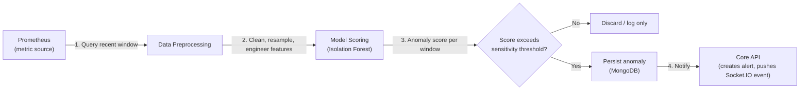
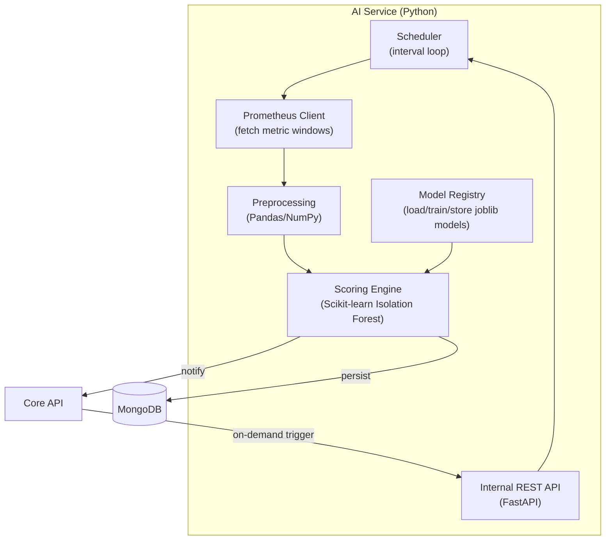

# AI Module Design Document
## AI-Powered DevOps Monitoring Platform — MVP

**Document Version:** 1.0
**Status:** MVP Baseline
**Related Documents:** 02-srs-mvp.md, 04-system-architecture.md, 05-data-model-erd.md, 06-api-specification.md

---

## 1. Purpose

This document defines how the AI Service detects anomalies in server and API metrics: data flow, preprocessing, model choice and justification, training strategy, scoring pipeline, communication contract with the Core API, and deployment shape. It implements SRS section 2.4 (FR-4.1–FR-4.5) and expands on Architecture Document §4.3.

---

## 2. Scope Recap

**In scope (MVP):**
- Unsupervised anomaly detection on Linux server metrics (CPU, memory, disk, network) and REST API metrics (response time, error rate)
- Near-real-time batch scoring (every 2–5 minutes, per FR-4.1)
- Per-resource, per-metric models (not one global model — see §5.3)

**Out of scope (Phase 2+, noted in Vision & Scope):**
- Failure prediction (forecasting future degradation)
- Root cause suggestions (requires correlated log data from ELK)
- AI-driven alert prioritization/ranking
- Cross-organization / global model training

---

## 3. Why Anomaly Detection, Not Static Thresholds

Static thresholds (e.g., "alert if CPU > 90%") are simple but blunt: a server that normally runs at 85% CPU generates constant noise, while a server that normally idles at 10% and suddenly jumps to 60% — genuinely abnormal for it — triggers nothing. The AI module's job is to learn **what's normal for each resource individually** and flag deviations from that learned baseline, which is what "AI-powered" means functionally in this platform, not just "uses a Python library."

Static threshold alerting (Alert Rules module, §7 of the API spec) is **retained in parallel**, not replaced — thresholds are still useful for hard operational limits (e.g., disk >95% is bad regardless of history). The two mechanisms are complementary and both feed the same `alerts` collection with `source: "threshold"` or `source: "anomaly"` (Data Model §4.7).

---

## 4. High-Level Workflow



This entire loop runs on a scheduled interval (§8.2), independently per monitored resource and metric.

---

## 5. Data Preprocessing

### 5.1 Input Retrieval
For each active `server` and `apiMonitor` in each organization, the AI Service queries Prometheus's HTTP query API for a rolling window of recent samples per relevant metric:

| Resource Type | Metrics Scored |
|---|---|
| `server` | `cpu_utilization`, `memory_utilization`, `disk_utilization` |
| `apiMonitor` | `response_time_ms`, `error_rate` |

Default window: **last 30 minutes**, sampled at Prometheus's scrape interval (e.g., 15s), scored every 2–5 minutes (FR-4.1) — meaning each scoring run evaluates a sliding window, not just the newest single point, which is what allows the model to judge a *pattern* rather than one noisy sample.

### 5.2 Cleaning
- **Missing data:** short gaps (a few missed scrapes) are forward-filled; if more than 50% of the expected window is missing (e.g., resource was unreachable), the run is skipped for that window and logged — an anomaly conclusion isn't drawn from insufficient data.
- **Outlier clipping:** physically impossible values (e.g., negative CPU%) are dropped as data errors, not scored as anomalies.

### 5.3 Feature Engineering
Per resource + metric, the model is trained on a small feature set derived from the window, using Pandas/NumPy:

| Feature | Description |
|---|---|
| `mean` | Mean value over the window |
| `std` | Standard deviation over the window |
| `min`, `max` | Range within the window |
| `rate_of_change` | Difference between window's last value and first value |
| `rolling_mean_delta` | Current window mean vs. previous window's mean |

**Design decision — per-resource models, not one global model:** A "normal" CPU baseline for a lightly-loaded dev server is entirely different from a production database server. Training one model across all resources would force it to learn an average that fits nothing well. Each `(orgId, resourceId, metric)` combination gets its own lightweight model, retrained periodically (§6.3). This keeps each model simple and fast, at the cost of needing many small models rather than one large one — an acceptable trade-off at MVP/portfolio scale (Vision & Scope §9 assumption: low-dozens of resources per org).

### 5.4 Normalization
Features are scaled (e.g., `StandardScaler` from Scikit-learn) before being passed to the model, fit per resource+metric alongside the model itself, since "normal" CPU ranges differ wildly by resource.

---

## 6. Model Selection: Isolation Forest

### 6.1 Why Isolation Forest
- **Unsupervised** — no labeled "this was an incident" training data exists or is practical to collect for a new platform; Isolation Forest doesn't need it (satisfies FR-4.2).
- **Efficient at low data volumes** — works reasonably well even with the modest history available early in a resource's monitored lifetime, unlike deep learning approaches that need large datasets.
- **Naturally produces an anomaly score**, not just a binary label — this maps directly to the `anomalyScore` field in the Data Model (§4.8) and lets the org tune sensitivity (API spec §9.4) without retraining.
- **Fast to train and score** — appropriate for near-real-time batch scoring on modest compute (no GPU requirement), consistent with the "single AI Service instance" MVP deployment (Architecture §9).
- **Well-supported in Scikit-learn**, matching the required tech stack.

### 6.2 Algorithm Summary (for documentation completeness)
Isolation Forest builds an ensemble of random decision trees that isolate data points by randomly splitting feature values. Anomalies — being rare and different — tend to be isolated in fewer splits (shorter average path length across the ensemble) than normal points. The model outputs an anomaly score derived from this average path length; lower path length → more anomalous → higher anomaly score in our normalized `0–1` representation (§7.3).

### 6.3 Training Strategy
- **Initial training:** Once a resource has accumulated a minimum history (e.g., 24 hours of data), an initial model is trained per `(resourceId, metric)` on that history.
- **Retraining cadence:** Models are retrained on a rolling schedule (e.g., daily) using the trailing N days of history (e.g., 14 days), so the model adapts to legitimate baseline drift (e.g., a server's normal load growing over weeks) rather than treating gradual, expected change as a permanent anomaly.
- **Cold start:** Until a resource has enough history for a trained model, the AI Service does not score it (no anomaly output) — the platform relies on threshold-based alerting alone for brand-new resources, which is communicated in the AI Insights UI (e.g., "Not enough data yet for AI analysis").
- **Contamination parameter:** Isolation Forest's `contamination` parameter (expected proportion of outliers) is set to a conservative default (e.g., `0.02`–`0.05`) and is one of the levers behind the org-level `anomalySensitivity` setting (API spec §9.4) — higher sensitivity effectively lowers the score threshold at which a result becomes a persisted anomaly, without needing to retrain the underlying model.

### 6.4 Model Storage
Trained models (`scikit-learn` objects, serialized via `joblib`) are persisted to disk within the AI Service container, keyed by `{orgId}_{resourceId}_{metric}.joblib`, with a lightweight metadata record (`modelVersion`, `trainedAt`, `trainingWindowStart/End`) — `modelVersion` is what gets attached to each anomaly record (Data Model §4.8) for traceability ("this anomaly was flagged by the model trained on 2026-07-01").

**MVP simplification, documented explicitly:** model files live on the AI Service container's local disk/volume, not in MongoDB or object storage. This is acceptable at MVP scale (few resources, single AI Service instance) but is called out here as a Phase 2 consideration if the AI Service needs to scale horizontally (models would need to move to shared storage, e.g., a mounted volume or object store, so any instance can score any resource).

---

## 7. Scoring Pipeline

### 7.1 Scoring Run (per resource + metric, every 2–5 minutes)
1. Load the trained model for `(resourceId, metric)`; skip if none exists yet (§6.3 cold start).
2. Fetch and preprocess the latest window (§5).
3. Compute the feature vector for the current window.
4. Run `model.decision_function()` (raw anomaly score) and `model.predict()` (inlier/outlier label) from Scikit-learn.
5. Normalize the raw score to a `0–1` scale for storage and comparison (§7.3).

### 7.2 Thresholding & Alert Generation
- If the normalized score exceeds the organization's configured `anomalySensitivity` (default e.g. `0.6`), the AI Service:
  1. Persists an `anomalies` document (Data Model §4.8) with the metric snapshot, score, and model version.
  2. Calls the Core API's internal insight-notification endpoint (§8.1 below) so the Core API can decide whether to also create an `alerts` document (per FR-4.5) and dispatch notifications.
- If the score is below threshold, nothing is persisted for that run (avoids flooding the `anomalies` collection with non-events) — only the aggregate "last scored at" state is updated for observability/debugging.

### 7.3 Score Normalization
Raw Isolation Forest scores from `decision_function()` are unbounded and centered around zero (negative = more anomalous). The AI Service maps this to a `0–1` scale using a min-max transform calibrated against each model's own training score distribution, so `anomalyScore` is comparable across different resources/metrics even though their raw model outputs are on different underlying scales — this is what makes a single org-wide `anomalySensitivity` setting meaningful (API spec §9.4).

---

## 8. Communication with the Core API

Per Architecture §4.3 and §4.6, the AI Service and Core API communicate over internal REST, not shared database writes triggering the notification — the AI Service's job ends at "anomaly detected and persisted," and the Core API owns all alerting/notification business logic (single responsibility, and keeps alert-creation rules in one place rather than duplicated in Python and Node).

### 8.1 AI Service → Core API

**`POST /internal/ai/insight-notify`** (internal-only, not exposed in the public API spec, secured via a shared internal service token, not user JWT)

**Request (from AI Service):**
```json
{
  "orgId": "org_123",
  "resourceType": "server",
  "resourceId": "srv_789",
  "anomalyId": "anm_901",
  "anomalyScore": 0.87,
  "metric": "memory_utilization",
  "detectedAt": "2026-07-11T10:05:30Z"
}
```

Core API then applies alert-creation logic (severity mapping from score, dedup against recent open alerts for the same resource/metric to avoid alert storms) and, if warranted, creates an `alerts` document and pushes the `alert:created` / `anomaly:detected` Socket.IO events (API spec §12).

### 8.2 Core API → AI Service

**`POST /internal/ai/score-now`** — on-demand scoring trigger (e.g., "score this resource immediately" for testing/demo purposes), optional convenience endpoint, not required for the scheduled loop to function.

**`GET /internal/ai/health`** — liveness/readiness check the Core API (or an orchestrator) can poll to detect if the AI Service is degraded, supporting the graceful-degradation behavior defined in Architecture §8.3 (dashboard/alerts continue functioning without AI if this service is down).

### 8.3 Scheduling Ownership
The AI Service owns its own scheduling internally (e.g., APScheduler or a simple interval loop in the Python process) rather than being triggered externally by the Core API for every run — this keeps the scoring cadence and preprocessing logic self-contained and independently tunable without Core API changes.

---

## 9. AI Service Internal Architecture



**Suggested module layout (Python):**

```
ai-service/
  app/
    main.py                 # FastAPI app entrypoint
    scheduler.py             # interval loop, orchestrates scoring runs
    prometheus_client.py      # query builder + HTTP client for Prometheus
    preprocessing.py         # cleaning, resampling, feature engineering
    model_registry.py         # load/save/train models (joblib)
    scoring.py               # runs a single scoring pass, normalizes score
    mongo_client.py           # writes anomalies collection
    core_api_client.py        # calls Core API's internal-notify endpoint
    config.py                # thresholds, intervals, env-driven settings
  models/                    # persisted .joblib model files (volume-mounted)
  requirements.txt
  Dockerfile
```

---

## 10. Deployment

Consistent with Architecture Document §6:

- Runs as its own container (`ai-service`) in the Docker Compose stack, built from a `python:slim` base image
- Dependencies: `scikit-learn`, `pandas`, `numpy`, `fastapi`, `uvicorn`, `requests` (or `httpx`), `joblib`, `apscheduler`
- Exposes port `8000` internally only (not published outside the Docker network per Architecture §8.2)
- `models/` directory mounted as a Docker volume so trained models survive container restarts
- Environment-driven configuration: Prometheus URL, Core API internal URL + service token, MongoDB URI, default scoring interval, default `anomalySensitivity`

**Health & failure behavior** (ties to Architecture §8.3): if the AI Service container is down, its `/internal/ai/health` check fails, the Core API marks AI Insights as "temporarily unavailable" in relevant API responses rather than erroring, and threshold-based alerting continues unaffected.

**Phase 2 scaling note:** if scoring volume grows beyond a single instance's capacity, the scheduler/scoring loop can be extracted behind a job queue (e.g., resources distributed across workers) — noted here as a deliberate simplification, not an oversight, consistent with Architecture §9.

---

## 11. Traceability

| Requirement | Design Section |
|---|---|
| FR-4.1 (periodic batch scoring) | §7.1, §8.3 |
| FR-4.2 (unsupervised, no manual thresholds) | §6.1, §6.3 |
| FR-4.3 (persist anomalies with snapshot + score) | §7.2, Data Model §4.8 |
| FR-4.4 (AI Insights view) | §8.1 (feeds Core API → API spec §9) |
| FR-4.5 (alert generation from anomaly score) | §7.2, §8.1 |
| NFR-3 (near-real-time dashboard) | §4 workflow loop cadence (2–5 min) |
