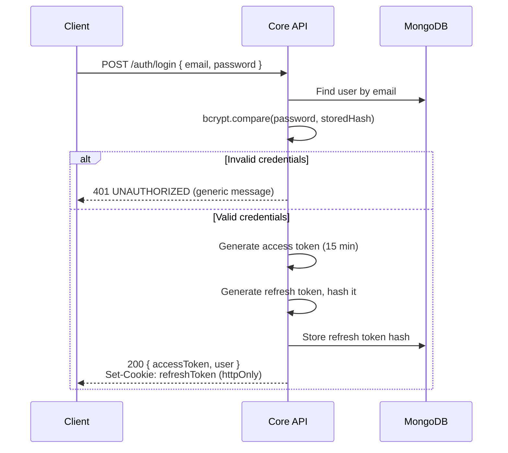

# Security Design Document
## AI-Powered DevOps Monitoring Platform — MVP

**Document Version:** 1.0
**Status:** MVP Baseline
**Related Documents:** 02-srs-mvp.md, 03-user-roles-permission-matrix.md, 04-system-architecture.md, 05-data-model-erd.md, 06-api-specification.md

---

## 1. Purpose

This document defines the concrete security implementation for authentication, authorization, tenant isolation, and API hardening. It formalizes decisions referenced but deferred in earlier documents — notably Data Model §6.5 (shared-DB tenancy trade-off) and API Spec §1.5 (404-not-403 behavior) — and defines the platform's posture against common attack classes.

**Security principle underlying this whole document:** every control here is enforced **server-side**. Frontend restrictions (hidden buttons, disabled routes) are UX conveniences only, never security boundaries, per Permission Matrix §5.

---

## 2. Authentication

### 2.1 Password Storage
- Passwords hashed with **bcrypt**, cost factor **12** (balances brute-force resistance against acceptable login latency; higher than the commonly-cited minimum of 10, appropriate since this isn't a high-throughput consumer auth system).
- Raw passwords are never logged, never included in error messages, never transmitted in any response payload.
- Password policy (enforced at registration and change, API Spec §2.1, §4.6): minimum 8 characters, at least one uppercase, one lowercase, one number. A max length (e.g., 128 chars) is also enforced to prevent bcrypt DoS via extremely long input.

### 2.2 JWT Access Tokens
- **Algorithm:** HS256 (symmetric, appropriate given both signing and verification happen within the same trusted Core API — no need for asymmetric RS256 at this architecture's scale).
- **Signing secret:** stored as an environment variable / secret (never committed to source control), rotated procedure documented in §9.3.
- **Claims:**
  ```json
  {
    "sub": "usr_123",
    "orgId": "org_123",
    "role": "org_admin",
    "iat": 1752230400,
    "exp": 1752231300
  }
  ```
- **Expiry:** 15 minutes. Short-lived by design — limits the damage window if a token is ever exposed (e.g., via XSS, logging, browser history), pushing the security burden onto the refresh flow instead, which is easier to revoke.
- **Storage on client:** access token held in **memory only** (JS variable / React state), never in `localStorage` or `sessionStorage` — this is the primary mitigation against token theft via XSS, since `localStorage` is readable by any script running on the page while an in-memory value isn't persisted or reachable outside the running app instance.

### 2.3 Refresh Tokens
- **Expiry:** 7 days.
- **Storage on client:** delivered as an **httpOnly, Secure, SameSite=Strict cookie** — not accessible to JavaScript at all, which closes the XSS-theft vector that in-memory access tokens still have during their (short) active window.
- **Storage on server:** only a **hash** of the refresh token is stored (`refreshTokens.tokenHash`, Data Model §4.3) — mirrors the bcrypt password pattern. If the database were ever compromised, stored refresh tokens would not be directly usable.
- **Rotation:** every use of a refresh token immediately revokes it and issues a new one (API Spec §2.3). This means a stolen-but-unused refresh token becomes useless the moment the legitimate user's client refreshes again — and gives a detection signal: if a revoked token is presented again, that's a strong indicator of token theft, and the response is to revoke **all** active sessions for that user (§9.2).
- **Revocation:** `refreshTokens.revoked` flag, plus a MongoDB TTL index on `expiresAt` (Data Model §4.3) so expired tokens are automatically purged rather than accumulating indefinitely.

### 2.4 Login Flow



Note the **generic error message** for invalid credentials (API Spec §2.2) — the same message is returned whether the email doesn't exist or the password is wrong, preventing user enumeration via differential error responses.

### 2.5 Session Termination
- **Logout** (API Spec §2.4): revokes the specific refresh token presented.
- **"Logout everywhere" / suspected compromise:** revokes all refresh tokens for a `userId` — used automatically on detected token-reuse (§2.3) and available as a manual user action ("log out of all devices").

---

## 3. Authorization (RBAC)

### 3.1 Enforcement Point
A single RBAC middleware runs after JWT verification and before any route handler, on every protected request (Architecture §8.1, Permission Matrix §5):

```
JWT verified → { userId, orgId, role } extracted →
  RBAC middleware checks (role, resource, action) against permission table →
  403 if disallowed → otherwise request proceeds with orgId injected into query context
```

### 3.2 Single Source of Truth
The permission table used by this middleware is implemented as a **shared, versioned config** (e.g., a `permissions.js`/`permissions.json` structure mirroring the Permission Matrix document's tables) — not scattered `if (role === 'org_admin')` checks copied across route handlers. This directly addresses the drift risk noted in API Spec §14: the documentation and the runtime behavior are generated from, or checked against, the same source.

### 3.3 Super Admin Boundary
Per Permission Matrix §4, `super_admin` has `orgId: null` (Data Model §4.2) and is authorized **only** for the specific platform-level endpoints (`GET /platform/organizations` and equivalents) — the RBAC middleware does not grant super_admin a bypass on org-scoped endpoints. This is enforced the same way as any other role: super_admin simply has no entries in the permission table for org-scoped resource actions, rather than relying on an "admin can do anything" escape hatch that would be easy to accidentally widen later.

---

## 4. Tenant Isolation

### 4.1 The Core Guarantee
Restated from Data Model §6: every document (except `organizations` itself) carries `orgId`, and every query is scoped by the `orgId` extracted from the verified JWT — never from client-supplied input. This is the platform's most important security invariant, since a failure here means one customer seeing another customer's infrastructure data.

### 4.2 Defense in Depth for Tenant Isolation
Because the MVP uses a shared database rather than database-per-tenant (a documented trade-off, Data Model §6.5), isolation is an application-layer guarantee rather than a physically-enforced one — which means it needs multiple layers, not one:

| Layer | Control |
|---|---|
| 1. Middleware | `orgId` extracted server-side from JWT only; never trusted from request body/query/headers |
| 2. Data access wrapper | All queries pass through a scoped-query helper that auto-injects `orgId` filter (Data Model §6.3) — direct unwrapped model calls are a code-review flag |
| 3. Response shaping | Cross-org lookups return `404`, not `403` (API Spec §1.5) — avoids confirming resource existence to unauthorized orgs |
| 4. Schema validation | MongoDB `$jsonSchema` validators require `orgId` on every collection (Data Model §5) — a document literally cannot be saved without one |
| 5. Testing | Dedicated cross-tenant access test suite (§10.3) — every resource-returning endpoint gets an explicit "org A cannot fetch org B's resource" test |

No single layer is trusted alone; this is intentional given the shared-DB model's inherent risk profile.

### 4.3 Socket.IO Isolation
Real-time events are scoped the same way: on connection, the server validates the JWT and joins the socket to room `org:{orgId}` server-side (Architecture §4.7) — the client never specifies which org's room to join. Events are only ever broadcast to the room matching the event's own `orgId`, never globally.

---

## 5. API Security

### 5.1 Transport
- Production deployment: HTTPS/WSS only, HTTP requests redirected. TLS termination handled at the ingress/reverse-proxy layer (Phase 2 Kubernetes Ingress; documented as a known local-only simplification for the MVP Docker Compose demo, per Architecture §8.2).
- HSTS header enabled in production to prevent protocol downgrade.

### 5.2 Input Validation
- All request bodies validated against a schema (e.g., `Joi`/`Zod` on the Node.js side) **before** reaching business logic — matches the validation rules documented per-endpoint in the API Specification.
- Validation failures return `400 VALIDATION_ERROR` with field-level detail, never a raw stack trace or ORM error message (which can leak schema/implementation details).

### 5.3 Output Encoding
- API responses are JSON only; the React frontend is responsible for safe rendering (React's default JSX escaping handles this for most cases — `dangerouslySetInnerHTML` is disallowed by convention anywhere user-supplied content is rendered, e.g., server names, alert messages).

### 5.4 CORS
- Core API CORS policy restricts allowed origins to the known frontend origin(s) (configured per environment), not `*` — since the API also handles cookie-based refresh tokens, an open CORS policy combined with credentialed requests would be a serious vulnerability.

### 5.5 Security Headers
Standard headers applied via middleware (e.g., `helmet` in Express): `X-Content-Type-Options: nosniff`, `X-Frame-Options: DENY` (clickjacking mitigation), `Content-Security-Policy` scoped to known script/style sources.

### 5.6 Rate Limiting
Per API Spec §13: stricter limits on `/auth/login` and `/auth/register` (brute-force mitigation) than general authenticated traffic. Implemented at the Core API middleware layer (e.g., token-bucket keyed by IP for auth endpoints, by `userId` for general endpoints).

### 5.7 Internal Service Communication
Core API ↔ AI Service internal endpoints (AI Module Design §8.1) are authenticated with a **shared internal service token** (not a user JWT, not unauthenticated) and are not reachable outside the Docker network (Architecture §8.2) — defense in depth even though network isolation is the primary control.

---

## 6. Common Attack Prevention

| Attack | Mitigation |
|---|---|
| **SQL/NoSQL Injection** | MongoDB driver's parameterized query building (never string-concatenated queries); input validation rejects unexpected types/operators in request bodies before they could be interpreted as query operators |
| **XSS** | React's default output escaping; CSP header (§5.5); access tokens never stored in `localStorage` so even a successful XSS has a narrower blast radius (short-lived in-memory token only, not the long-lived refresh token which is httpOnly) |
| **CSRF** | Refresh token cookie set with `SameSite=Strict`, meaning it isn't sent on cross-site requests; state-changing endpoints require the `Authorization: Bearer` header (which a CSRF attack cannot forge, unlike a cookie alone) — the combination of both is what closes this off, not either alone |
| **Brute-force login** | Rate limiting on `/auth/login` (§5.6); bcrypt's inherent slowness; generic error messages preventing enumeration (§2.4) |
| **User enumeration** | Identical response/timing for "unknown email" vs. "wrong password" on login; registration duplicate-email response deliberately doesn't distinguish "this exact org" vs "email used elsewhere" beyond the necessary `409` |
| **Token replay** | Short access token expiry (15 min); refresh token rotation with reuse detection (§2.3) |
| **IDOR / cross-tenant access** | §4.2 defense-in-depth; `404` response pattern (§4.2 layer 3) |
| **Privilege escalation via role tampering** | Role lives in the signed JWT and server-side user record, never accepted as client input on protected endpoints; role changes only via the dedicated `PATCH /users/:id/role` endpoint, itself RBAC-gated to org_admin only |
| **Mass assignment** | Request schemas (§5.2) are allow-list based — only explicitly defined fields are accepted per endpoint; a client cannot smuggle in `{"role": "org_admin"}` on an unrelated update call |
| **Denial of service (basic)** | Rate limiting (§5.6); request body size limits; bcrypt max input length cap (§2.1) |
| **Secrets exposure** | JWT signing secret, DB connection strings, internal service token all via environment variables/secrets management, never committed to source control; `.env` files gitignored |

---

## 7. Multi-Tenancy Threat Model Summary

Given the shared-database architecture (Data Model §6.5), the primary tenant-isolation threat is **application-layer bugs**, not external attackers breaking encryption — i.e., the risk is a developer forgetting an `orgId` filter, not a sophisticated exploit. This reframes what "secure" means for this specific design:

- The mandatory query-wrapper pattern (§4.2 layer 2) exists specifically to make this class of bug structurally harder to introduce.
- Code review should treat any new direct-model-access query (bypassing the wrapper) as a security-relevant change requiring extra scrutiny, not just a style nit.
- The cross-tenant test suite (§10.3) is treated as a **security control**, not just a QA nice-to-have — it's the automated backstop for the one risk this architecture is most exposed to.

---

## 8. Role-Specific Security Notes

- **Super Admin** is the highest-trust role but has the *narrowest* data access (Permission Matrix §4) — a deliberate inversion of "most privileged = most access," reducing the impact of a compromised super_admin account, since it structurally cannot read org-internal data even if compromised.
- **Viewer** role has read-only permissions enforced at both RBAC (§3) and, redundantly, at the route level (no mutating endpoints accept `viewer` in their allowed-roles list at all, rather than relying on a single permission check).

---

## 9. Operational Security Practices

### 9.1 Logging
- Authentication events (login success/failure, logout, token refresh, token-reuse detection) are logged with `userId`/`orgId` (not raw tokens or passwords) for audit and incident investigation.
- Logs are structured (JSON) to support later ingestion into the Phase 2 ELK stack without rework.

### 9.2 Incident Response (Token Reuse Detection)
As noted in §2.3, presentation of an already-rotated (revoked) refresh token triggers: revoke all active sessions for that `userId`, log a security event, and (Phase 2+) notify the affected user via email that all sessions were terminated due to suspicious activity.

### 9.3 Secret Rotation
JWT signing secret rotation procedure (documented for completeness, even if not automated in MVP): support for a brief dual-secret verification window (accept tokens signed by either the old or new secret) during rotation, so existing valid access tokens aren't invalidated mid-rotation; refresh tokens naturally cycle out within 7 days.

### 9.4 Dependency Hygiene
Both Node.js (`npm audit`) and Python (`pip-audit` or equivalent) dependency trees should be checked for known vulnerabilities as part of the build process — noted here as a practice, with actual CI enforcement being a Phase 2+/tooling concern rather than an MVP architectural one.

---

## 10. Testing Requirements Derived from This Document

| Area | Required Test Coverage |
|---|---|
| 10.1 Auth | Login with valid/invalid credentials, expired/invalid JWT rejection, refresh token rotation, refresh token reuse triggers full revocation |
| 10.2 RBAC | Every endpoint tested against every role — both "allowed roles succeed" and "disallowed roles get 403" |
| 10.3 Tenant isolation | For every resource-returning endpoint: user in org A cannot read/update/delete a resource belonging to org B (expect `404`); Socket.IO events for org A never delivered to an org B connection |
| 10.4 Input validation | Boundary and malformed-input cases per endpoint (oversized strings, wrong types, invalid enums) return `400`, not a 500 or unhandled exception |
| 10.5 Password/token handling | Passwords never appear in logs or responses; refresh token cookie has correct `httpOnly`/`Secure`/`SameSite` attributes in integration tests |

---

## 11. Traceability

| SRS Requirement | Security Design Section |
|---|---|
| FR-1.2 (bcrypt hashing) | §2.1 |
| FR-1.3, FR-1.4 (JWT + refresh) | §2.2, §2.3, §2.4 |
| FR-1.5 (token revocation) | §2.3, §2.5 |
| FR-1.7, FR-1.9 (org scoping / no cross-org access) | §4 |
| FR-1.8 (RBAC across 5 roles) | §3 |
| NFR-1 (security: bcrypt, JWT, refresh) | §2 |
| NFR-2 (multi-tenancy enforcement) | §4 |
