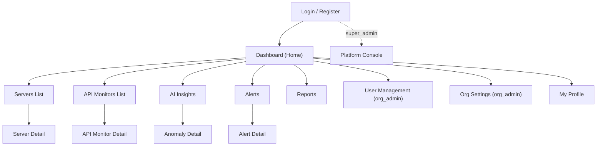

# UI/UX Design Document
## AI-Powered DevOps Monitoring Platform — MVP

**Document Version:** 1.0
**Status:** MVP Baseline
**Related Documents:** 02-srs-mvp.md, 03-user-roles-permission-matrix.md, 06-api-specification.md

---

## 1. Purpose

This document defines every screen in the MVP, how users navigate between them, what each dashboard widget shows, the visual design system (color, type, spacing), responsive behavior, and end-to-end user journeys per role. It is the frontend counterpart to the API Specification — every screen here consumes specific endpoints already defined in `06-api-specification.md`.

**Design intent:** the product should read as a serious operations tool — dense with real information, calm rather than flashy, fast to scan under stress (an engineer looking at this during an incident should find the answer in seconds, not admire the UI). This is the opposite design goal from a marketing site: legibility and information density over decoration.

---

## 2. Design System

### 2.1 Color Palette

A dark-first palette is used, matching the convention of operations/monitoring tools (Datadog, Grafana, New Relic all default to dark) — engineers frequently keep these dashboards open for long stretches, and dark backgrounds reduce eye strain and make status colors (red/yellow/green) pop more clearly than on white.

| Token | Hex | Usage |
|---|---|---|
| `--bg-primary` | `#0B0F14` | App background |
| `--bg-surface` | `#131A22` | Cards, panels, sidebar |
| `--bg-surface-raised` | `#1B2530` | Modals, dropdowns, hover states |
| `--border-subtle` | `#26313D` | Card borders, dividers |
| `--text-primary` | `#E8EDF2` | Primary text |
| `--text-secondary` | `#8B99A8` | Secondary/muted text, labels |
| `--text-disabled` | `#4A5563` | Disabled states |
| `--accent-primary` | `#3B82F6` | Primary actions, links, focus rings |
| `--accent-primary-hover` | `#2563EB` | Hover state for primary actions |
| `--status-healthy` | `#22C55E` | Healthy / up / resolved |
| `--status-degraded` | `#F59E0B` | Degraded / warning / medium severity |
| `--status-down` | `#EF4444` | Down / critical / open high-severity alert |
| `--status-unknown` | `#64748B` | Unknown / no data / cold-start resource |
| `--ai-accent` | `#A855F7` | AI Insights-specific accents (badges, anomaly highlights) — visually distinguishes "the AI flagged this" from standard threshold alerts |

A light theme is not in MVP scope; the design system's tokens are structured (CSS variables) so one could be added in Phase 2 without a rework.

### 2.2 Typography

| Token | Font | Usage |
|---|---|---|
| Primary typeface | Inter (or system-ui fallback) | All UI text — highly legible at small sizes, standard choice for data-dense interfaces |
| Monospace typeface | JetBrains Mono (or ui-monospace fallback) | Metric values, log/JSON snippets, resource identifiers (hostnames, IPs, IDs) — monospace makes numeric columns scannable and visually signals "this is raw system data" |

| Scale | Size / Weight | Usage |
|---|---|---|
| `text-xs` | 12px / 500 | Table labels, metadata, timestamps |
| `text-sm` | 14px / 400–500 | Body text, table cell content |
| `text-base` | 16px / 400 | Default body copy (forms, descriptions) |
| `text-lg` | 18px / 600 | Card titles, section headers |
| `text-xl` | 22px / 600 | Page titles |
| `text-2xl` | 28px / 700 | Key metric callouts (e.g., large uptime % on a summary card) |

### 2.3 Spacing & Layout Grid
- Base spacing unit: 4px (Tailwind default scale), primary layout uses 8/12/16/24px steps.
- Main content area: 12-column grid, max-width constrained on very large screens (≥1920px) to avoid overly stretched line lengths in tables/cards.
- Card padding: 16px (compact) or 24px (standard), consistently applied.

### 2.4 Component Conventions
- **Status badges** consistently use the status color tokens (§2.1) across every screen — a "Down" badge on the server list, the API monitor list, and an alert card all use the identical red, so users pattern-match status at a glance without re-learning color meaning per screen.
- **AI-sourced content** (anomaly badges, AI Insights cards, AI-triggered alerts) consistently uses `--ai-accent` (purple) as a secondary marker alongside status color — e.g., an alert card is red because it's "high severity" but also carries a small purple "AI Detected" tag if `source: anomaly`, so users learn to distinguish "the AI found something novel" from "a known threshold was crossed" throughout the whole product, not just on one page.
- **Empty states** are designed deliberately (not blank pages) — e.g., "No servers registered yet" includes a direct call-to-action to register one, and the AI Insights cold-start case (AI Module Design §6.3) is shown as "Collecting baseline data — AI analysis available in ~24h" rather than an empty list that looks broken.

---

## 3. Information Architecture & Navigation

### 3.1 Primary Navigation (Sidebar)

Persistent left sidebar, present on all authenticated screens, item visibility driven by role (Permission Matrix):

```
[Org Logo/Name]
─────────────────
🏠 Dashboard
🖥️  Servers
🔌 API Monitors
🧠 AI Insights
🔔 Alerts
📄 Reports
─────────────────
👥 Users              (org_admin only)
⚙️  Org Settings        (org_admin only)
─────────────────
🛡️  Platform             (super_admin only — replaces the entire sidebar above)
─────────────────
[User avatar / name / role badge]
[Notification bell icon]
[Logout]
```

### 3.2 Top Bar
- Left: current page title + breadcrumb (e.g., "Servers / prod-web-01")
- Right: notification bell (badge count of unread, opens dropdown per §5.9), user menu (profile, logout)

### 3.3 Navigation Map



---

## 4. Page Inventory

Each entry lists: purpose, primary API endpoints consumed, and role visibility.

| # | Page | Purpose | Key Endpoints | Roles |
|---|---|---|---|---|
| 1 | Login | Authenticate | `POST /auth/login` | Public |
| 2 | Register Organization | Create org + admin account | `POST /auth/register` | Public |
| 3 | Dashboard (Home) | Org-wide health summary | `GET /servers`, `GET /api-monitors`, `GET /alerts?status=open` | All |
| 4 | Servers List | Browse/manage monitored servers | `GET /servers`, `POST /servers` | All (create: org_admin, devops_engineer) |
| 5 | Server Detail | Metrics, status, alert rules for one server | `GET /servers/:id`, `GET /servers/:id/metrics`, `GET /alert-rules?resourceId=` | All (edit: org_admin, devops_engineer) |
| 6 | API Monitors List | Browse/manage monitored APIs | `GET /api-monitors`, `POST /api-monitors` | All (create: org_admin, devops_engineer) |
| 7 | API Monitor Detail | Uptime, response time, alert rules | `GET /api-monitors/:id`, `GET /api-monitors/:id/metrics` | All (edit: org_admin, devops_engineer) |
| 8 | AI Insights | List of detected anomalies | `GET /anomalies` | All |
| 9 | Anomaly Detail | Full metric snapshot for one anomaly | `GET /anomalies/:id`, `PATCH /anomalies/:id/review` | All (review: org_admin, devops_engineer, team_lead) |
| 10 | Alerts | Active/historical alert list | `GET /alerts`, `PATCH /alerts/:id/acknowledge`, `PATCH /alerts/:id/resolve` | All (ack/resolve: org_admin, devops_engineer, team_lead) |
| 11 | Alert Detail | Full alert context + linked anomaly if applicable | `GET /alerts/:id` | All |
| 12 | Reports | Generate CSV exports | `GET /reports/export` | All |
| 13 | User Management | Invite/manage org users | `GET /users`, `POST /users/invite`, `PATCH /users/:id/role`, `DELETE /users/:id` | org_admin |
| 14 | Org Settings | Org profile, notification defaults, AI sensitivity | `GET/PUT /organizations/me`, `PUT /organizations/me/ai-settings` | org_admin |
| 15 | My Profile | Own account, password, notification prefs | `GET/PATCH /users/me`, `PATCH /users/me/notification-preferences` | All |
| 16 | Platform Console | Cross-org high-level view | `GET /platform/organizations` | super_admin |

---

## 5. Page-Level Design Detail

### 5.1 Login / Register
- Centered single-column form on the dark background, minimal chrome — this is the one place in the product where density is intentionally low (first impression, not an ops screen yet).
- Register flow is a single form (org name + admin email + password) rather than a multi-step wizard, consistent with the MVP's "self-service signup" requirement (FR-1.1) — no unnecessary friction before a new org can start using the product.

### 5.2 Dashboard (Home)

The single most important screen — what a user sees immediately after login, designed for the "quick health check" journey (§7.1).

**Layout (top to bottom):**
1. **Summary strip** — 4 stat cards: Total Servers (with healthy/degraded/down breakdown), Total API Monitors (up/down breakdown), Open Alerts (by severity), New AI Insights (last 24h)
2. **Resource status grid** — compact card per server/API monitor showing name, status badge, one key metric (CPU% for servers, response time for APIs), click-through to detail
3. **Recent Alerts panel** — latest 5 open alerts, severity-colored, with quick acknowledge action inline
4. **Recent AI Insights panel** — latest 5 anomalies, purple AI-accent tag, click-through to Anomaly Detail

**Widget: Summary Stat Card**
```
┌─────────────────────────┐
│ SERVERS            🖥️   │
│                          │
│ 12                       │
│ ● 9 Healthy ● 2 Degraded │
│ ● 1 Down                 │
└─────────────────────────┘
```

**Real-time behavior:** stat cards and status grid update live via Socket.IO `metric:update`/`alert:created` events (API Spec §12) — a status dot transitions color with a brief highlight animation on change, so an engineer watching the dashboard during an incident sees it happen rather than needing to refresh.

### 5.3 Servers List
- Table view (not cards) — for a list-oriented, scan-heavy page, a dense table with sortable columns (Name, Status, CPU%, Memory%, Last Seen) serves the "find the problem fast" use case better than a card grid, which is reserved for the dashboard's summary context instead.
- Filter bar: status filter (healthy/degraded/down/unknown), label filter, search by name/host.
- "Add Server" button (org_admin/devops_engineer only) opens a modal form, not a separate page — registering a server is a quick, low-friction action that shouldn't require a full navigation.

### 5.4 Server Detail
**Layout:**
1. Header: server name, host address, status badge, action buttons (Edit, Delete — role-gated)
2. Metric graphs: CPU, Memory, Disk as time-series line charts, time-range selector (1h/6h/24h/7d) driving `GET /servers/:id/metrics`
3. Alert Rules panel: list of configured thresholds for this server, inline add/edit (role-gated)
4. Related Alerts panel: alert history scoped to this resource
5. Related AI Insights panel: anomaly history scoped to this resource

### 5.5 API Monitors List / Detail
Structurally mirrors §5.3/§5.4, with API-specific fields: URL, method, expected status, uptime % (24h), avg response time, error rate — replacing CPU/memory/disk with response-time and error-rate graphs on the detail page.

### 5.6 AI Insights
- List view, default sorted newest-first, each row shows: resource name, metric, anomaly score (visualized as a small horizontal bar/gauge, not just a raw number — a 0.87 score is more immediately readable as "87% confidence, mostly full bar" than as a bare decimal), reviewed/unreviewed state, timestamp.
- Filter: resource, reviewed/unreviewed, date range.
- Cold-start resources (AI Module Design §6.3) shown in a separate "Collecting Baseline" section rather than mixed into the main list, so it's clear these aren't silently broken — just not ready yet.

### 5.7 Anomaly Detail
- Shows the full `metricSnapshot` window as a chart with the anomalous region highlighted (purple accent overlaid on the metric line) — the goal is that a user can visually see *why* the model flagged this window, not just trust a black-box score.
- "Mark Reviewed" / "Dismiss as false positive" actions with optional note field (`PATCH /anomalies/:id/review`).
- If `alertId` is set, a direct link to the linked Alert Detail page.

### 5.8 Alerts
- Table view, filterable by status/severity/resource type, severity shown as a colored left-border accent on each row (scannable at a glance down the whole list, not just per-cell).
- Bulk-acknowledge is **not** included in MVP — deliberately, since silently mass-acknowledging alerts without individual review is a pattern that leads to missed incidents; each alert requires an individual action.
- AI-sourced alerts carry the purple "AI Detected" tag (§2.4) alongside standard severity styling.

### 5.9 Notifications (Dropdown, not a full page in MVP)
- Bell icon in top bar opens a dropdown panel (not a dedicated route) — notification volume at MVP scale doesn't justify a full page; a scrollable dropdown listing recent notifications with "mark all read" is sufficient (`GET /notifications`, `PATCH /notifications/read-all`).

### 5.10 Reports
- Simple form: report type (metrics/alerts/anomalies), resource filter (optional), date range picker (capped at 90 days per API Spec §11.1), "Generate CSV" button that triggers a browser download.
- No report history/list page in MVP (audit log exists server-side per Data Model §4.10, but isn't exposed as a browsable UI list — noted as a natural Phase 2 addition, e.g., scheduled reports needing a history view).

### 5.11 User Management (org_admin)
- Table: email, role (editable inline dropdown), status (active/invited), remove action.
- "Invite User" opens a modal (email + role selector) — mirrors the low-friction pattern from Server registration (§5.3).

### 5.12 Org Settings (org_admin)
- Sections: Org Profile (name), Notification Defaults (alert email recipients), AI Settings (anomaly sensitivity slider, mapped to `anomalySensitivity` 0–1, API Spec §9.4, with plain-language labels like "Fewer, high-confidence alerts" ↔ "More sensitive, catches subtler anomalies" rather than exposing the raw 0–1 number as the only guidance).

### 5.13 My Profile
- Own info (read-only email, editable name), change password form, notification preference toggles (email/in-app).

### 5.14 Platform Console (super_admin)
- Entirely separate navigation shell (§3.1) — reinforces that Super Admin is operating the platform, not "inside" any org.
- Table of organizations: name, user count, resource count, active alert count, active/suspended status — **no drill-down into any org's actual servers/alerts/anomalies**, consistent with Permission Matrix §4. This is a deliberate UI constraint mirroring a backend authorization boundary, not just a design choice — the UI should not even offer a click-through that the API would reject anyway.

---

## 6. Responsive Behavior

The product is designed **desktop-first** — this is a professional operations tool primarily used on a workstation during monitoring/incident-response work, unlike a consumer app where mobile-first is typically the default assumption. Responsive behavior below ensures usability on smaller screens (e.g., checking status from a tablet or phone) without treating mobile as the primary experience.

| Breakpoint | Range | Behavior |
|---|---|---|
| Desktop | ≥1280px | Full sidebar (expanded, labeled), multi-column dashboard grid, side-by-side detail page panels |
| Laptop | 1024–1279px | Sidebar remains, dashboard grid reduces to 2 columns |
| Tablet | 768–1023px | Sidebar collapses to icon-only (expandable on hover/tap), dashboard grid becomes single column, tables gain horizontal scroll for wide columns |
| Mobile | <768px | Sidebar becomes a slide-out drawer (hamburger trigger), all grids single-column, detail-page panels stack vertically, tables switch to a card-per-row layout (each row's columns become labeled stacked fields) rather than horizontal scroll, since horizontal-scrolling tables are a poor experience on touch |

**Charts on small screens:** time-series graphs simplify (fewer visible gridlines/labels, larger touch targets on any interactive points) rather than being hidden — status visibility during an incident shouldn't disappear just because someone is checking from a phone.

---

## 7. User Journeys

### 7.1 Journey: DevOps Engineer — Morning Health Check
1. Logs in → lands on **Dashboard**
2. Scans summary strip — sees "1 Down" server, "2 Open Alerts"
3. Clicks the down server in the status grid → **Server Detail**
4. Reviews CPU/memory graphs, sees a sustained spike before it went down
5. Checks **Related AI Insights** panel on the same page — an anomaly was flagged 10 minutes before the outage
6. Clicks through to **Anomaly Detail** to see the flagged window
7. Returns to **Alerts**, acknowledges the relevant alert, adds context, resolves once the server recovers

### 7.2 Journey: Org Admin — Onboarding a New Organization
1. Completes **Register Organization** → immediately authenticated, lands on empty **Dashboard**
2. Empty-state prompt directs to **Servers List** → registers first server via modal
3. Navigates to **API Monitors** → registers first API endpoint
4. Navigates to **User Management** → invites a DevOps Engineer and a Viewer
5. Navigates to **Org Settings** → sets notification email defaults
6. Returns to **Dashboard** — resources now show "Unknown" status, transitioning to real status as Prometheus begins scraping

### 7.3 Journey: Viewer — Weekly Status Review
1. Logs in → **Dashboard** (read-only view, no action buttons rendered)
2. Reviews summary strip and resource grid
3. Navigates to **Reports** → generates a CSV of the past week's alerts for a stakeholder update
4. No access to Servers/API Monitors creation, User Management, or Org Settings in the sidebar at all — nothing to accidentally click that would fail with a permission error, per the "hide, don't just disable" convention (§2.4/NFR-9)

### 7.4 Journey: Team Lead — Alert Triage
1. Logs in → **Dashboard**, filters directly to **Alerts** page
2. Filters by severity = high/critical
3. Acknowledges alerts as reviewed, adds notes
4. Cross-references **AI Insights** for alerts tagged "AI Detected" to understand *why* they fired, not just that they fired
5. Generates a CSV report of the week's alert activity for a team retro

### 7.5 Journey: Super Admin — Platform Health Glance
1. Logs in → lands directly on **Platform Console** (different landing page than org roles, since there's no "my org" dashboard for this role)
2. Scans organization list for any org with unusually high alert counts or inactive status
3. No further drill-down available by design (§5.14) — if deeper investigation is needed, that's an explicit, separate support-access feature, not part of this console (Permission Matrix §4)

---

## 8. Accessibility Notes (MVP baseline)

- Color is never the *only* signal for status — status badges pair color with text/icon (e.g., a red dot is always accompanied by the word "Down," not color alone), supporting colorblind users.
- Interactive elements maintain visible focus states (leveraging `--accent-primary` as the focus ring color) for keyboard navigation.
- Minimum text contrast ratios follow WCAG AA against the dark background palette (§2.1 tokens were chosen with this in mind — e.g., `--text-secondary` still clears AA against `--bg-surface`).
- Full WCAG audit / screen-reader testing is noted as a Phase 2+ hardening item, not claimed as complete in this MVP baseline.

---

## 9. Traceability

| Requirement | UI/UX Section |
|---|---|
| FR-5.x (Dashboards) | §5.2 |
| FR-2.x, FR-3.x (Server/API monitoring) | §5.3–5.5 |
| FR-4.x (AI anomaly detection) | §5.6, §5.7 |
| FR-6.x (Alerts, notifications) | §5.8, §5.9 |
| FR-7.x (Reporting) | §5.10 |
| Permission Matrix (role-based visibility) | §3.1, §4 (roles column), §5.14 |
| NFR-9 (hide, don't just disable, role-gated actions) | §2.4, §7.3 |
| NFR-3 (near-real-time updates) | §5.2 real-time behavior |
